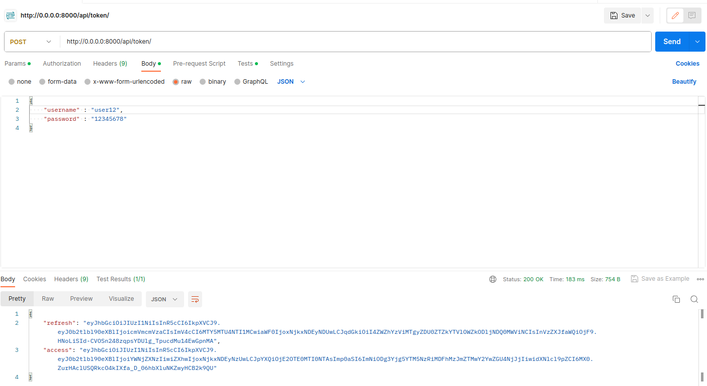
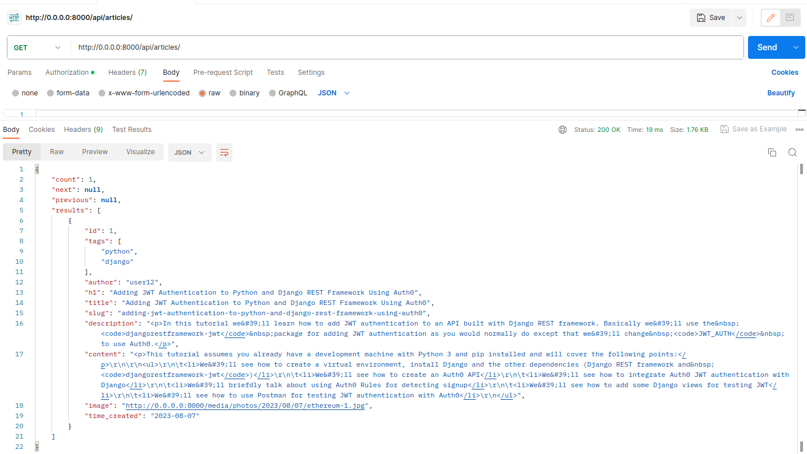

# <div align="center">BLOG API ⚙️</div>

<div align="center">

</div>

<br/>

I made this django project to explore new technologies and libraries, as well as hone my docker containerization skill.
In this project, I have collected the most popular and necessary tools for creating complex and full-fledged projects.

## Description

<div align="center">

</div>

<br/>

This is one of the most complex Django projects that I have implemented to date. I created an online store where you can
log in through social networks or register, receive email confirmation letters, purchase various products, sort them by
categories, and then pay through the Stripe system. You can also see a list of all your orders and their status. This is
a fully functional and ready-to-use online store.

Since I position myself as a backend developer, I focused on the internal components, not the appearance of the
site.

## Technologies

***Languages***


***Framework***


***Databases***


***Libraries***


***Other***


The main technologies used in the project are data caching with Redis, asynchronous email confirmation sending (I also
implemented the sending mechanism myself), social media authentication through django-allauth. The most time-consuming
task was connecting to Stripe. In addition to writing a controller that handles payments, I also had to configure
webhook operation. I also integrated Stripe products and the django admin panel so that when a new product is added, the
data is also updated in Stripe. It was not easy to package all of this into a Docker container, ensure the seamless
operation of each service, and automate the deployment of the web application in Docker.

## Project setup

***Method 1: Via docker-compose***

1. Create a .env file and paste the data from the .env.example file into it.
2. Generate django secret key on [this site](https://djecrety.ir/) and specify it in the SECRET_KEY variable.
3. Specify the user, password and name for the PostgreSQL and insert the values in the variables POSTGRES_USER,
   POSTGRES_PASSWORD, POSTGRES_DB.
4. Create an email and configure it to send messages. You can learn more about how to do
   this [here](https://youtu.be/dnhEnF7_RyM?t=902).
5. Run the project by entering following command:

```
docker-compose up -d --build
```

6. Perform migration to the database:

```
docker-compose exec web python manage.py migrate
```

7. Create a superuser by entering the following command:

```
docker-compose exec web python manage.py createsuperuser
```

8. You can log in to the [admin panel](http://0.0.0.0:8000/admin) and add new articles and comments or upload the
   fixtures I created by entering the command:

```
docker-compose exec web python manage.py loaddata core/fixtures/blog.json
```


***Method 2: Via virtual environment***

Installation via a virtual environment is much more difficult, because the project has many third-party services. You
will have to additionally install Redis, Postgresql, Stripe CLI, and change the project settings. If you want to install
the project through a virtual environment, please contact me and I will give you instructions.

## <div align="center">
Thank you for taking the time to review my project. I hope you find it useful and enjoyable to use! 👋</div>
